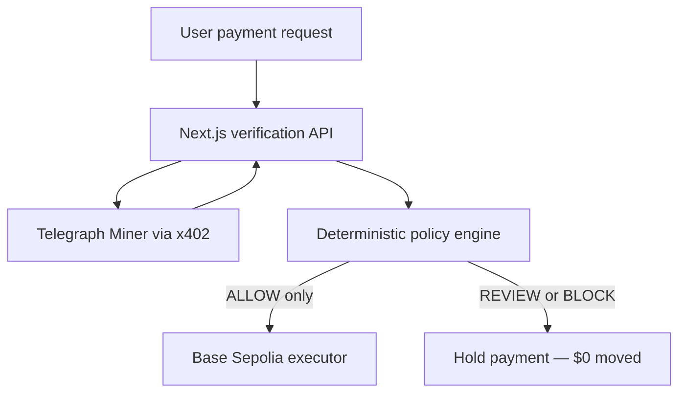

# ProofPay architecture

ProofPay places deterministic authenticity verification in front of an autonomous testnet payment. External results are never simulated, and every uncertain state holds the transfer.

## Trust boundaries

- The browser submits a payment request and renders the returned Decision Ticket. It never receives private keys.
- The server performs Telegraph/x402 calls, normalizes Miner results, evaluates policy, and conditionally invokes the executor.
- The policy engine is pure TypeScript. Only an exact `ALLOW` verdict can cross the payment gate.
- Telegraph, x402, RPC, malformed-response, timeout, and unknown-state failures all fail closed.
- The payment executor is restricted to Base Sepolia. No mainnet chain is configured.

## Decision order

1. Invalid evidence or risk at/above `0.85` produces `BLOCK`.
2. Missing, failed, timed-out, unparseable, or materially conflicting signals produce `REVIEW`.
3. `ALLOW` requires every required signal to be successful, risk at/below `0.35`, confidence at/above `0.80`, and pairwise risk deltas below `0.30`.
4. Every unmatched state defaults to `REVIEW`.
